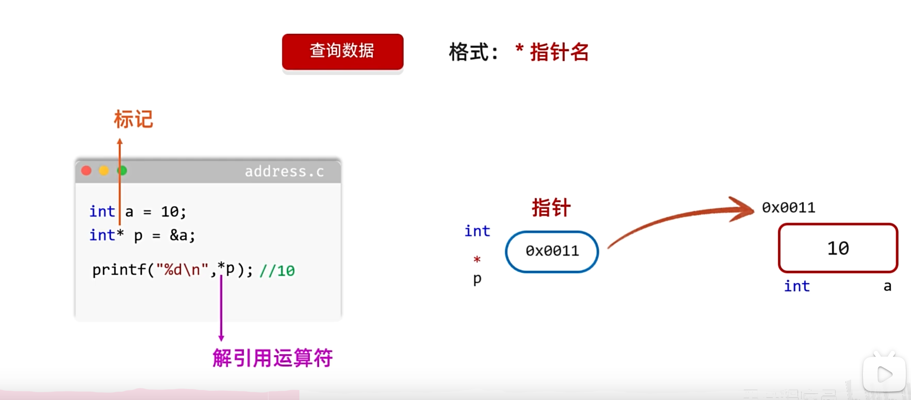

## 指针的定义

    指针是内存地址，通过指针可以找到对应空间并获取/修改其中的数据
    用于存内存地址的变量叫指针变量
    数据类型*变量名（数据类型要和指向变量保持一致）
    指针本身占用内存空间，但占用大小与指针无关，与编译器有关

给指针变量赋值时，不能把一个数值赋值给指针变量，只能把一个变量的地址赋值给指针变量
```c
int main()
{
    int i = 10;//定义整形变量i
    char c = 'a';//定义字符变量c
    int *i_pointer = &i;//定义指针变量i_pointer，指向变量i，并初始化
    char *c_pointer = &c;//定义指针变量c_pointer
    c_pointer = &i;//将i的地址赋值给c_pointer
    printf("%d", *i_pointer);
    printf("%c", *c_pointer);
    return 0;
}
```

指针的类型决定了解引用时“读取几个字节、如何解释这些字节”。比如：
* int * 会按4字节读、解释成整数；
* char * 只读1字节，解释为字符。


---

#### 🔍 程序解析：

```c
#include "stdio.h"

int main() {
    int a = 10;
    int *p_a = &a;

    char c = 'c';
    char *p_c = &c;

    printf("a size = %ld \t", sizeof(a));
    printf("p_a size = %ld \n", sizeof(p_a));

    printf("c size = %ld \t", sizeof(c));
    printf("p_c size = %ld \n", sizeof(p_c));

    return 0;
}
```

---

##### 📏 程序输出（在64位系统上）大致会是：

```
a size = 4      p_a size = 8
c size = 1      p_c size = 8
```

---

##### ✅ 各项解释：

| 项目    | 类型       | 占用字节数 | 原因                               |
| ----- | -------- | ----- | -------------------------------- |
| `a`   | `int`    | 4 字节  | 通常 4 字节表示一个整型                    |
| `p_a` | `int *`  | 8 字节  | 指针在 **64位系统** 中通常占用 8 字节（即 64 位） |
| `c`   | `char`   | 1 字节  | `char` 只表示一个字符，正好 1 字节           |
| `p_c` | `char *` | 8 字节  | 虽然它指向的是 `char`，但它本身仍是一个指针，占 8 字节 |

---

##### 🚀 关键知识点总结：

1. **所有指针变量在同一平台下通常占用相同的字节数**，与它指向的数据类型无关。

   * 64 位系统：8 字节（64 位地址）
   * 32 位系统：4 字节（32 位地址）

2. `sizeof` 是 **在编译期计算**的，用来查看数据类型或变量在内存中所占的空间。

3. 指针类型决定了解引用 `*p` 时的行为，而**不影响 `sizeof(p)` 的结果**。

---

##### 🎯 拓展一下（你可以试试）：

如果你加上以下代码：

```c
printf("sizeof(int*) = %ld\n", sizeof(int*));
printf("sizeof(char*) = %ld\n", sizeof(char*));
printf("sizeof(double*) = %ld\n", sizeof(double*));
```

你会发现它们 **全都是 8（在64位系统）**。这能进一步验证「指针的大小不随其指向的类型而变化」。


 