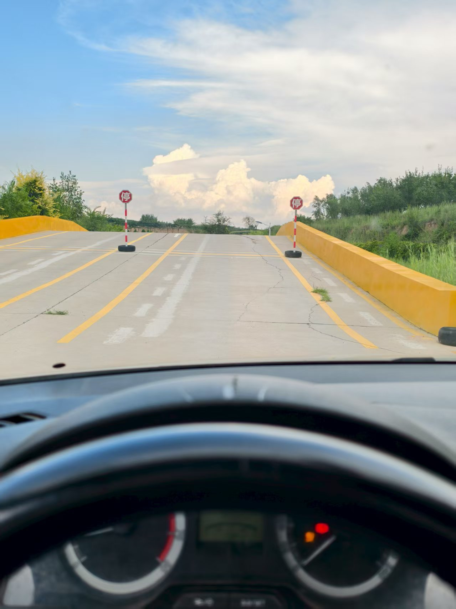
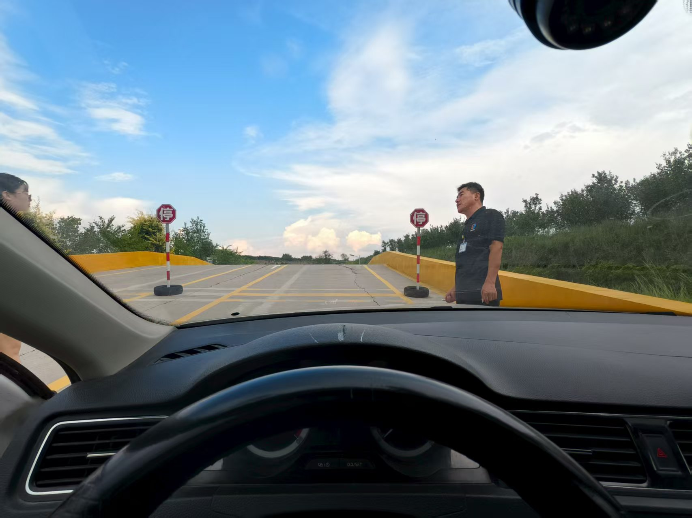
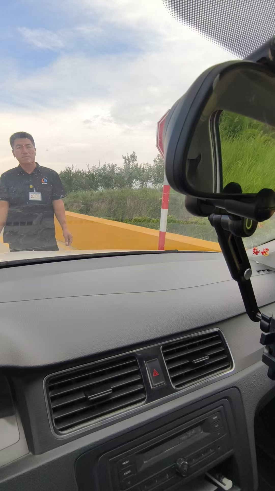
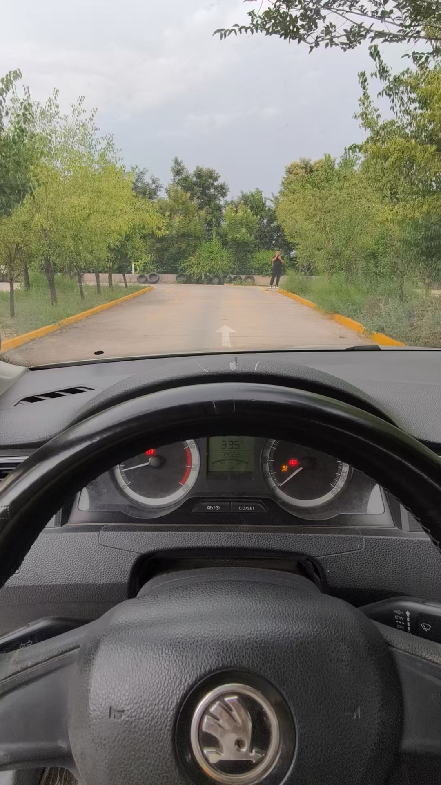
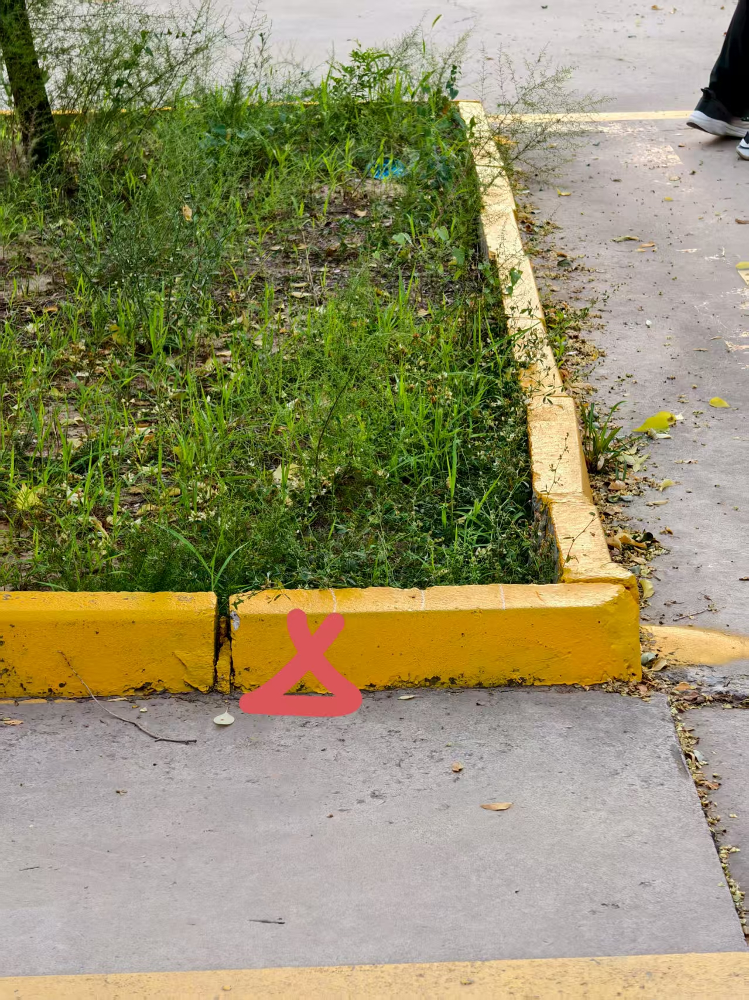

## 上车准备

1. 检查座椅高度，脑袋距离车顶2个扁拳头。
2. 把方向盘归位，踩死离合刹车，膝盖距离方向盘下部1个拳头高度。
3. 手臂伸直，手腕达到方向盘位置，否则调整靠背
4. 调整后视镜。
5. 系好安全带。
6. 看看是否已经启动，未启动先启动，踩死离合刹车，放手刹。
## 倒车入库
 1. 左拐进入考场时，肩膀与拐角末端对齐，向左打死，车身摆正直接回正。
 2.开至黄虚线与肩膀对齐，换倒挡倒车
 3. 倒车至第二个水泥缝，方向盘向车尾摆动方向打死，后视镜(*右边看左镜，左边看右边镜子*)看见第一个车库角回半圈，看见第二个库角回一圈，调整车尾端,让左后视镜车身距离边线前部稍微窄与后部。左边同理。

加速驶离，下一个半坡

 

## 半坡起步
12 点方向正对箭头的左侧，肩膀与黄线差不多对齐的时候向左打一圈半，进入口的位置（稍微靠右）回半圈，快到两条黄线中间的时候 向左回半圈。

 中间偏右开

:::: steps
1. 第一个点

 

2. 第二个点

3. 第三个点

   ::: tip
   到了放手刹，2s，刹车离合踩死，离合器后跟离开地面放30，继续以毫米精度放到车微微抖动，动力不够脚前掌加，动力够了左脚卡死，刹车数2秒抬起，方向盘3-4秒回正，车歪了回正
   :::

4. 下坡时踩死离合，溜下去，刹车脚慢慢摩擦
5. 到下一项目直角路牙，向左打死拐弯

::::
## 侧方停车
12点到黄线接近中间一把回完方向
:::: steps
1. 步骤 1
黄线快消失，车头快碰到箭头，肩膀对齐水泥缝，停车

2. 步骤 2

  停下看右边宽度，打一圈方向，换倒挡

3. 步骤 3
   
   看左后视镜，两条黄线露出来，一把回正，车轮正中心压到黄线，一把向左打死，看车尾端，稍微变窄停车

   ::: tip
   停下后右手左边开灯，然后换挡
   :::

4. 
* 12点延长线刚碰到对面黄线，一把回正。
* 引擎盖正中间铆钉位置碰到黄线，向右打一圈
* 12点正对箭头 车正马上回正

5. 打左转向灯
::::

## 直角弯
* 车头快碰到黄线，向左看找到要打方向的点，一把向左打死

## S弯
* 先从后视镜下面找到黄线，黄线到后视镜与左边黄线分开两指宽，向左打一圈，保持
* 车窗口把黄线挡完向右打一圈回正
* 铆钉覆盖黄线向右打一圈
* 肩膀对准黄线方向，回正